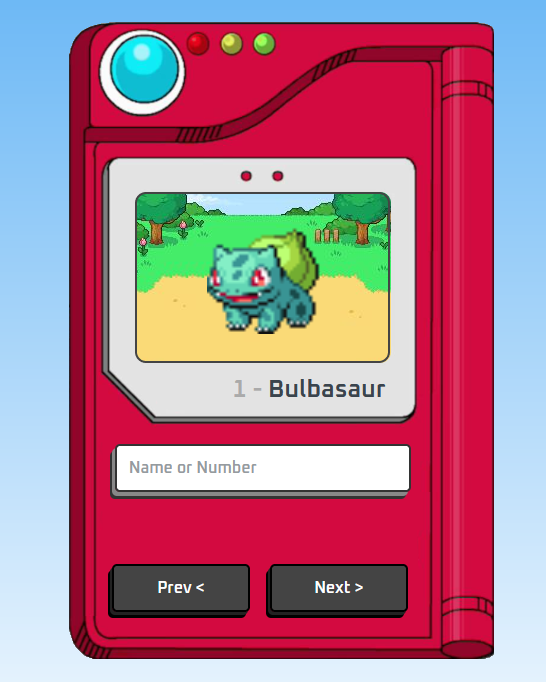

Projeto Pokédex

1. Descrição Geral

Este projeto é uma Pokédex interativa, desenvolvida com HTML, CSS e JavaScript. Ele permite que os usuários pesquisem Pokémons pelo nome ou número e 
naveguem entre diferentes Pokémons usando botões de navegação. As informações são obtidas da PokéAPI. O design é responsivo, garantindo uma boa experiência
tanto em dispositivos móveis quanto em desktops.

2. Tecnologias Utilizadas

    HTML5: Estrutura básica do projeto.
    CSS3: Estilos e layout responsivo.
    JavaScript (ES6+): Manipulação do DOM e consumo da API.
    PokéAPI: API pública que fornece dados sobre Pokémons.

3. Estrutura de Arquivos

pokemon/
│
├── favicons/
│   └── favicon-16x16.png      # Ícone do site.
│
├── images/
│   └── pokedex.png            # Imagem da Pokédex.
│
├── style.css                  # Arquivo CSS com a estilização da Pokédex.
├── main.js                    # Arquivo JavaScript com a lógica da aplicação.
├── index.html                 # Página HTML principal.
└── README.md                  # Arquivo de documentação.

 API Utilizada

A aplicação consome a PokéAPI, uma API pública que fornece dados sobre os Pokémons, incluindo nome, número, imagem e outras informações relevantes. 
Para cada busca, a aplicação faz uma requisição à API para obter os dados do Pokémon correspondente.
4. Interface do Usuário

A interface da Pokédex foi projetada para ser intuitiva e visualmente agradável. Abaixo estão os principais componentes da interface:

    Campo de Pesquisa: O usuário pode inserir o nome ou número de um Pokémon para realizar a busca.
    Imagem do Pokémon: Exibe a imagem do Pokémon correspondente à busca.
    Nome e Número do Pokémon: Apresenta o nome e o número do Pokémon.
    Botões de Navegação: Permitem que o usuário navegue entre diferentes Pokémons de forma sequencial.

5. Responsividade

A aplicação é totalmente responsiva, utilizando técnicas de CSS para ajustar o layout de acordo com o tamanho da tela do dispositivo. 
Isso garante uma experiência fluida tanto em dispositivos móveis quanto em desktops, com fontes e elementos dimensionados proporcionalmente.

6. Como Funciona

    O usuário insere o nome ou número do Pokémon no campo de pesquisa e a aplicação faz uma requisição à PokéAPI.
    Quando os dados são recebidos, a imagem, nome e número do Pokémon são atualizados na interface.
    O usuário pode navegar entre os Pokémons utilizando os botões de navegação.

7. Estrutura de Pastas

    index.html: Página principal que carrega o layout e estrutura do projeto.
    style.css: Arquivo de estilos que define o visual da Pokédex.
    main.js: Arquivo JavaScript que contém a lógica da aplicação, incluindo a integração com a PokéAPI.
    Imagens e Favicons: A pasta de imagens contém a imagem da Pokédex e o favicon do site.

8. Melhorias Futuras

    Mais Dados do Pokémon: Exibir mais informações além do nome e número, como tipo, habilidades e estatísticas.
    Animações: Adicionar animações de transição para melhorar a experiência do usuário ao navegar entre os Pokémons.
    Favoritos: Implementar uma funcionalidade para que os usuários possam salvar seus Pokémons favoritos.

9. Conclusão

Este projeto da Pokédex oferece uma interface simples e funcional para busca e exibição de Pokémons. 
Combinando tecnologias modernas e uma API pública, ele demonstra conceitos importantes de desenvolvimento frontend, como manipulação de DOM, responsividade e consumo de APIs REST.
